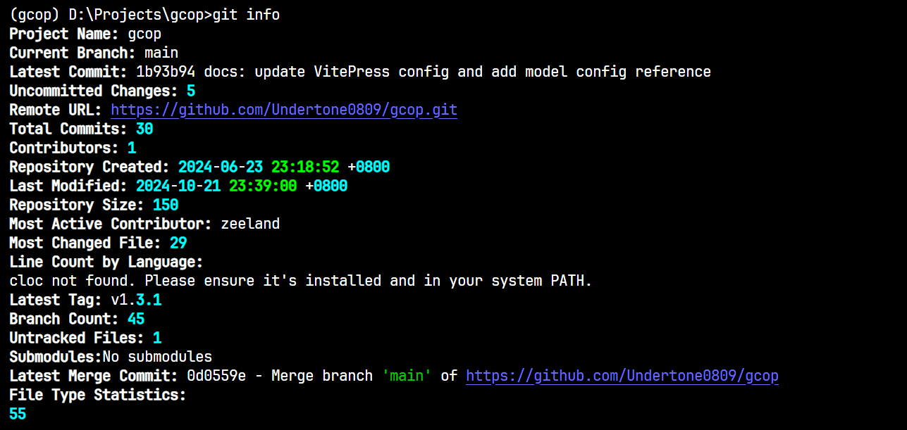

# Quick Start Guide

This guide will help you get started with GCOP (Git Copilot) quickly and easily.

## Prerequisites

Before you begin, ensure you have the following:

- Python 3.8 or newer
- Git installed on your system
- An API key for your preferred LLM (e.g., OpenAI, Anthropic)

## Installation

1. Install GCOP using pip:

   ```
   pip install gcop
   ```

2. Initialize GCOP:

   ```
   gcop init
   ```

   This command sets up GCOP and adds its aliases to your Git configuration.

3. Configure your AI model:

   ```
   git gconfig
   ```

   This opens the configuration file. Edit it to include your AI provider details:

   ```yaml
   model:
     model_name: provider/name, eg openai/gpt-4o
     api_key: your_api_key
   ```

   How to config your model? Please refer to [How to Config Model](../how-to-config-model.md)

   The `config.yaml` file will be stored in:
   - Windows: `%USERPROFILE%\.zeeland\gcop\config.yaml`
   - Linux: `~/.zeeland/gcop/config.yaml`
   - MacOS: `~/.zeeland/gcop/config.yaml`

4. Verify the installation:

   ```
   git ghelp
   ```

   You should see a list of available GCOP commands.

## Basic Usage

### Generating AI Commit Messages

1. Stage your changes:

   ```
   git add .
   ```

2. Generate and apply an AI commit message:

   ```
   git c
   ```

> Some times, if you use `git add .` and `git c` together, you can use `git ac` as a shortcut.

<script setup>
import IFrame from '/components/iframe.vue'
</script>

<IFrame src="https://www.youtube.com/embed/iP5qYxFaLS4" />

1. You can accept the default message, retry, retry by your feedback or exit after the AI generates the commit message.

Finally, you can see the commit message like this:


```bash
(gcop) D:\Projects\gcop\docs>git ac
[Code diff] 
...


[Thought] The changes involve updating the VitePress configuration to use an environment variable for the website ID, adding a reference to a new documentation page in the quick-start guide, and correcting a URL in the model configuration documentation. These changes are primarily 
related to documentation and configuration updates.
[Generated commit message]
docs: update VitePress config and add model config reference

- Update VitePress config to use environment variable for website ID
- Add reference to model configuration guide in quick-start documentation
- Correct URL in model configuration documentation

These changes improve the clarity and accuracy of the documentation, ensuring that users can properly configure the website and understand how to set up models.
? Do you want to commit the changes with this message? yes
[main 5612f60] docs: update VitePress config and add model config reference
 3 files changed, 5 insertions(+), 2 deletions(-)
```

### Viewing Repository Information

To get a detailed overview of your repository, use:

```
git info
```

This command now displays comprehensive information about your repository, including:

- Project name
- Current branch
- Latest commit
- Number of uncommitted changes
- Remote URL
- Total number of commits
- Number of contributors
- Repository creation time
- Last modified time
- Repository size
- Most active contributor
- Most changed file
- Line count by language (if cloc is installed)
- Latest tag
- Branch count
- Untracked files count
- Submodule information
- Latest merge commit
- File type statistics

This detailed information provides a thorough understanding of your project's state, history, and composition. It's particularly useful for quickly assessing the repository's overall structure and recent activities.

For example:



> Note: Some features like line count by language require additional tools (e.g., cloc) to be installed.

### Other Useful Commands

- `git ac`: Add all changes and commit with an AI-generated message
- `git p`: Push changes to the remote repository
- `git undo`: Undo the last commit while keeping changes staged
- `git gconfig`: Open the GCOP configuration file for adjustments

For more detailed information on each command, refer to the [Commands](./commands.md) section.

## Next Steps

- Explore the [Introduction](./introduction.md) for an overview of GCOP's features
- Check out the [How to Config Model](../how-to-config-model.md) guide for advanced configuration options
- Visit our [FAQ](../faq.md) for common questions and troubleshooting

Start enhancing your Git workflow with GCOP today!
